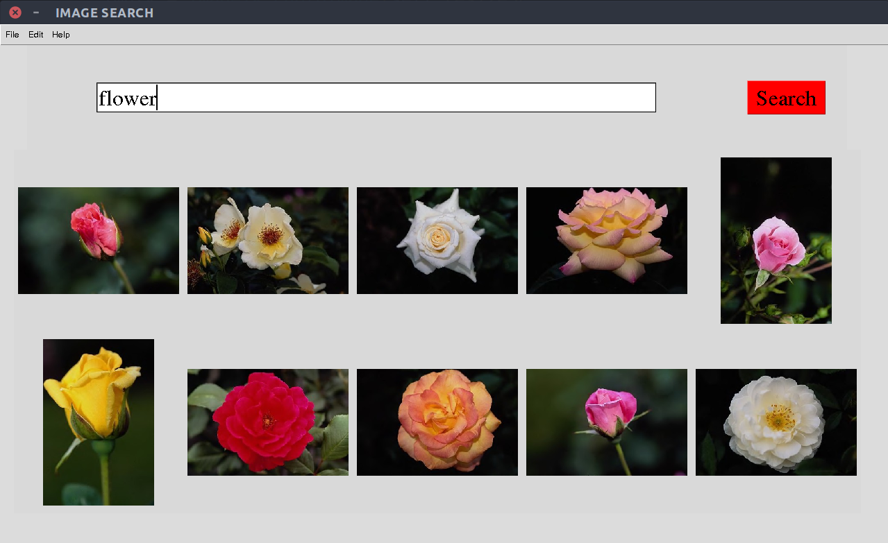
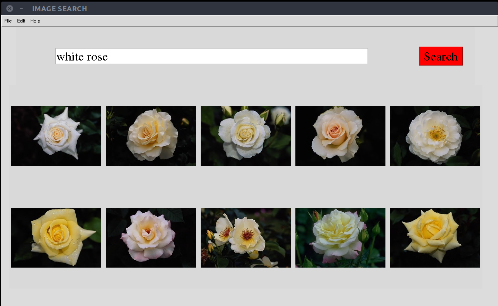

# image-search
Query By Image Content

## Install:

pip install -r requirements.txt

## Demo:
python gui.py

## Search your photo library:
##### Step 1: Replace the path './Corel-1000/' in the python file 'index.py' with the path to your image repository, then run the command:
python index.py
##### Step 2: Search:
python gui.py

## Contact:

sangkv.work@gmail.com
